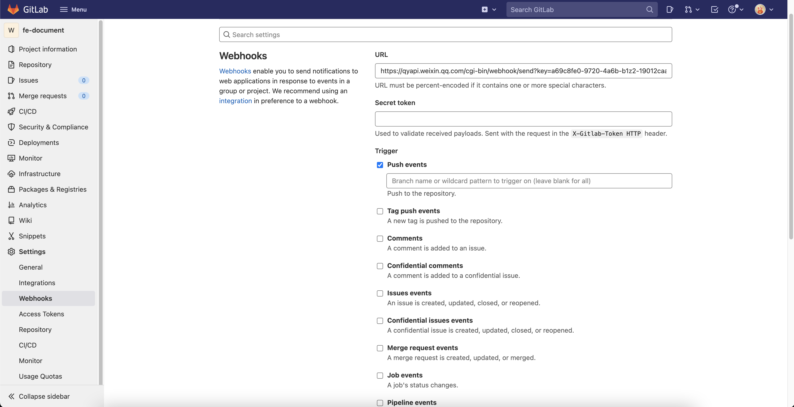

<div align="center">
  <h1>webhook项目</h1>
  <p>向webhooks推送消息（用于消息通知）</p>
</div>

## ✨ 特性

- 🛡 使用 Egg.js + Typescript 开发

## 功能

- [X] 🔨 GitLab相关操作推送企业微信群组
- [X] 👌 持续迭代与更新

## 配置GitLab项目Webhook

> 以服务部署地址 `http://192.168.31.54:7001` 为例🌰

1. 使用**Maintainer身份**进入GitLab需要添加自动推送的项目,进入设置 => 集成.
2. 配置Webhook。如企业微信群组机器人Webhook地址为 `https://qyapi.weixin.qq.com/cgi-bin/webhook/send?key=a69c8fe7-2750-4z1a-b5d2-19012cbb229c`, 将问号后的key值与服务部署地址拼接为`http://192.168.31.54:7002/gitlab/a69c8fe7-2750-4z1a-b5d2-19012cbb229c`, 作为地址填入URL, 如下图:

3. 勾选需要进行消息推送的Trigger.

**注意：取消勾选‘Enable SSL verification’**。点击**Add Webhook**按钮,完成配置.

## 快速入门

### 💻 本地调试

```bash
$ npm install
$ npm run dev
$ open http://localhost:7001/
```

**注意：不要在开发模式下进行TSC编译, 如果你运行了 "tsc", 那么你需要在 "npm run dev "之前 "npm run clean".**

### Deploy

```bash
$ npm run tsc
$ npm start
```

### Npm Scripts

- Use `npm run lint` to check code style
- Use `npm test` to run unit test
- se `npm run clean` to clean compiled js at development mode once

> 📢 Node.js 8.x
>
> 📢 Typescript 2.8+

## 🤝 参与共建

如果您对这个项目感兴趣, 欢迎提 pull request, 也欢迎 "Star" 支持一下 ^\_^
